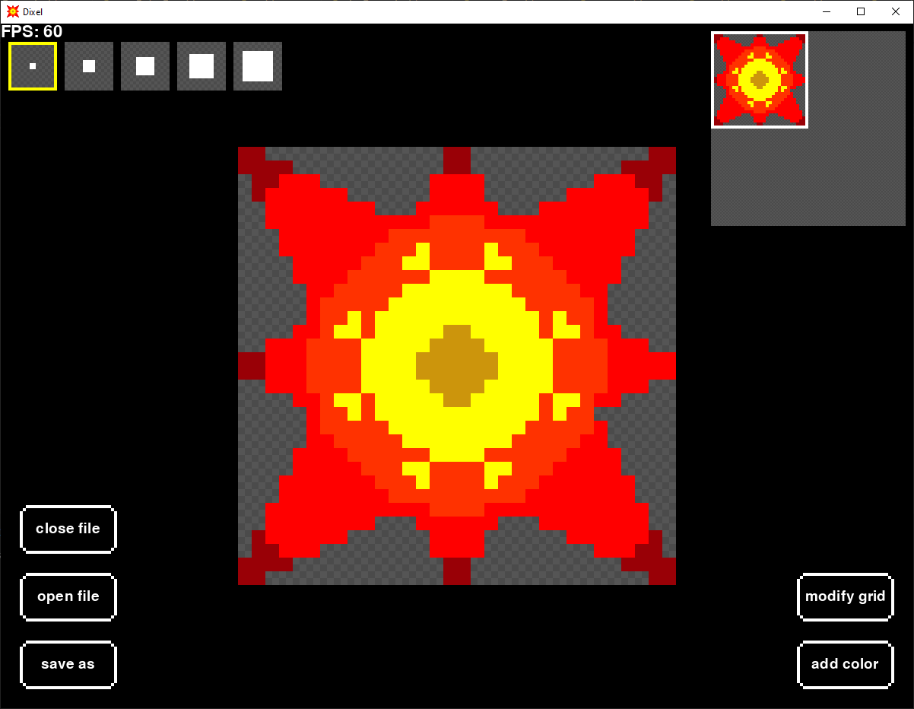
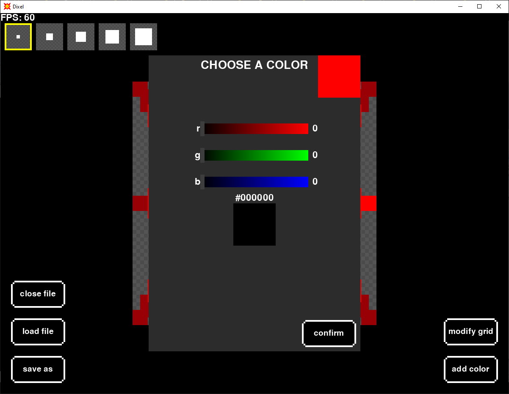
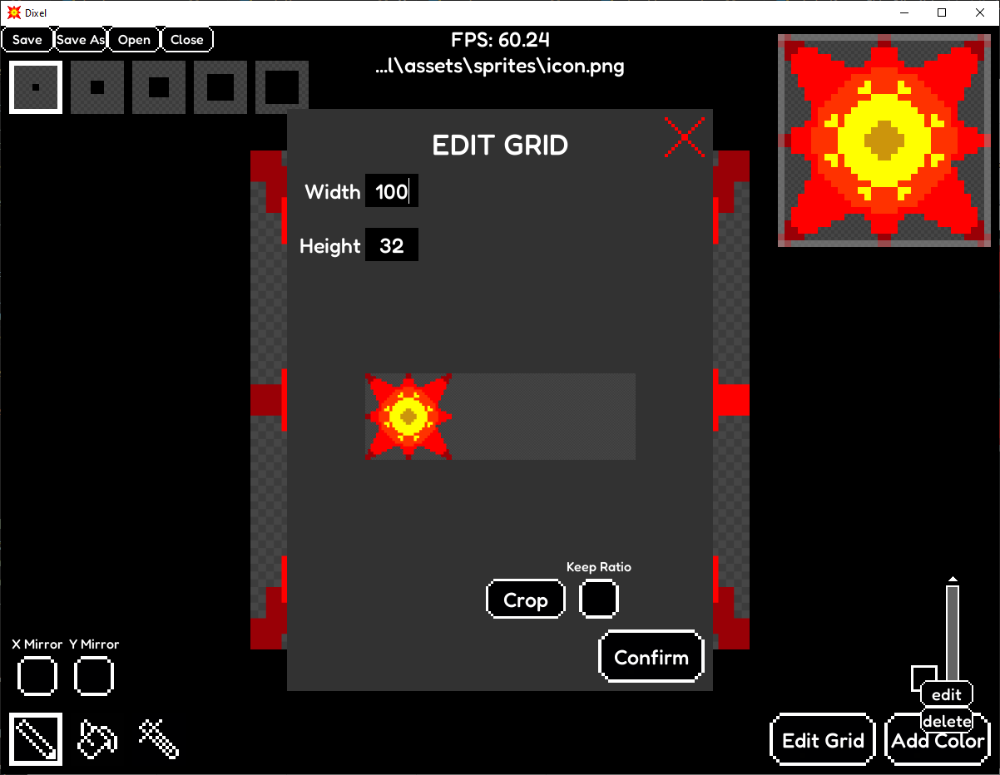

Requires pygame-ce, numpy, Pillow, pygetwindow and screeninfo.

## Features

- **Load Images**: Import pngs into a pixel grid.
- **View Navigation**: Move the view for large images.
- **Edit Pixels**: Color and erase pixels.
- **Color Picker**: Select colors with a colorful and intuitive UI.
- **Brush Size**: Select the brush size using checkboxes.
- **Resizable Grid**: Change the grid size and have a preview of how it will look.
- **Minimap**: At any point there's a minimap in the top right corner with a white square to indicate the current position
- **Auto Save**: If you're editing an existing image it will be saved when the program or the file is closed, if the program crashes the image will always be saved.

## Keyboard Shortcuts

- **CTRL + A**: Go to add color ui
- **CTRL + M**: Go to modify grid ui
- **CTRL + S**: Save file with name
- **CTRL + O**: Open file
- **CTRL + Q**: Close file
- **CTRL + Backspace**: Exit in ui
- **CTRL + Enter**: Confirm in ui

- **CTRL + 1-5**: Change brush size
- **ALT + arrows**: move selected pixel by brush size
- **SHIFT + arrows**: move selected pixel by visible area
- **CTRL + arrows**: move selected pixel to the limit of the grid

- **CTRL + left/right**: switch between scrollbar and input box in color picking ui
- **CTRL + k**: toggle check box in grid ui

## Screenshots

### Main Interface

### Color Picker

### Grid UI

