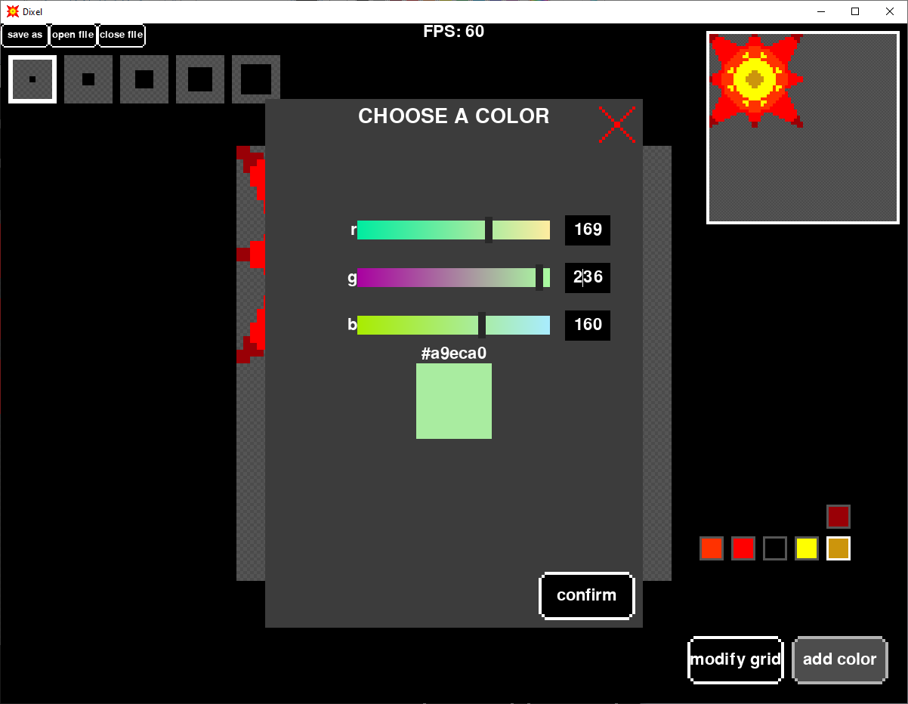

# Dixel

Drawing program for pixel art.

## Install instructions

Requires python 3.10.0 or higher, it can be installed from <https://www.python.org/downloads/>.\
Check with ```python3 --version```.

1. Clone the repository ```git clone https://github.com/Aston7292/dixel.git```
2. Open a terminal and go in the project directory
3. (Optional) Use a virtual environment
   * Make sure venv is installed on Linux\
   ```sudo apt update``` then ```sudo apt install python3-venv```
   * Create ```python3 -m venv virtual_environment```
   * Activate on Windows ```virtual_environment\Scripts\activate```
   * Activate on Linux ```source virtual_environment/bin/activate```
4. Install packages ```python3 -m pip install -r requirements.txt```
5. Run app ```python3 main.py```
6. (Optional) You can exit the virtual environment with ```deactivate```

### Possible errors (Linux)

* If importing tk fails\
```sudo apt update``` then ```sudo apt install python3-tk```.
* If you're not in a virtual environment and pip returns an "externally-managed-environment" error\
```python3 -m pip install -r requirements.txt --break-system-packages```.

## Features

**Load Images**: Import pngs and bitmaps into a pixel grid.\
**View Navigation**: Move the view for large images.\
**Edit Pixels**: Color and erase pixels.\
**Brush Size**: Select the brush size using checkboxes.\
**Palette Options**: Edit or delete a color from a palette with a drop-down menu.\
**Zooming**: Zoom in/out towards the mouse.\
**Minimap**: See the current position on the grid with a minimap.\
**Color Picker**: Select colors with a colorful and intuitive UI.\
**Resizable Grid**: Modify the grid and have a preview of how it will look.\
**Auto Save**: If you're editing an existing image it will be saved on close,
if the program crashes the image will always be saved.

### Tools

**Pencil**: Change individual pixels\
**Bucket**: Fill a section or change the color of all matching pixels\
**Eyedropper**: Pick a color from the image

## Keyboard functionality

### Window

**F1**: Reset window size\
**F5-F8**: Resize window\
**F11**: Toggle fullscreen

### Home

**ESC**: Close window\
**CTRL S**: Save file\
**CTRL SHIFT S**: Save file with name\
**CTRL O**: Open file\
**CTRL W**: Close file\
**SHIFT H**: Mirror tool horizontally\
**SHIFT V**: Mirror tool vertically\
**CTRL SHIFT P**: Add palette\n
**CTRL P 1-9**: Change palette\
**CTRL A**: Go to add color UI\
**CTRL G**: Go to edit grid UI\
**CTRL ,**: Open settings\
**arrows/page down/page up/home/end/+/-**: Move in scrollbars\
**CTRL +/-** Move to the limit of the scrollbar

### Checkbox grids

**arrows/home/end**: Move\
**CTRL arrows**: Move to the limit of the grid\

**CTRL B 1-5**: Change brush size\

**CTRL C 1-9**: Change color\
**CTRL E**: Edit selected color\
**CTRL Del**: delete selected color\

**SHIFT P**: Select pencil tool\
**SHIFT B**: Select bucket tool\
**SHIFT E**: Select eye dropper tool\
**SHIFT L**: Select line tool\
**ALT**: Temporarily select eye dropper tool

### Grid

**arrows**: Move\
**Enter**: Draw\
**Backspace**: Erase\
**TAB arrows**: Move selected pixel by brush size\
**SHIFT arrows**: Move selected pixel by visible area\
**CTRL arrows**: Move selected pixel to the limit of the grid\
**CTRL +/-**: Zoom in/out\
**CTRL SHIFT +/-**: Zoom in/out until limit\
**CTRL Z**: Undo\
**CTRL SHIFT Z/CTRL Y**: Redo\
**CTRL R**: Reset offset and visible area

### UIs

**Escape**: Close\
**Enter**: Confirm\
**arrows/tab/SHIFT tab**: Move selection\
**CTRL left/right**: Go to end of text in input box\
**+/-**: Increment/decrement in numerical input box\
**CTRL +/-**: Reach limit in numerical input box\

**CTRL K**: Toggle keep ratio in grid UI\
**CTRL C**: Crop in grid UI\
**CTRL R**: Rotate right in grid UI\
**CTRL SHIFT R**: Rotate left in Grid UI

### Settings

**CTRL F**: Show/hide fps counter in settings\
**CTRL C 1-5**: Change fps cap\
**CTRL S**: Choose crash save directory

## Screenshots

### Main Interface


### Color Picker



### Grid UI


