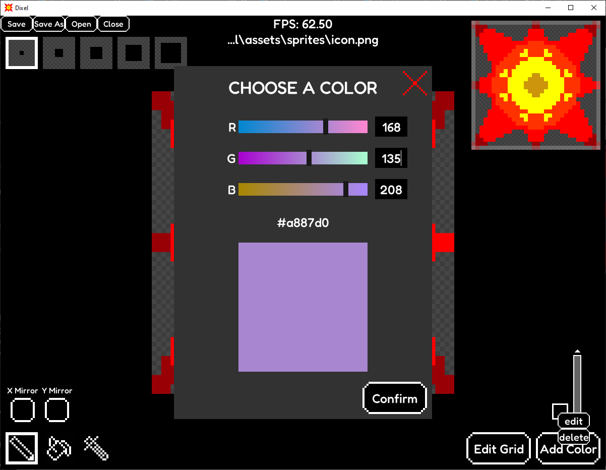

# Dixel

Drawing program for pixel art.

## Install instructions

* git clone this repository in your local system
* Open your terminal and cd into the cloned repository folder
* execute
```python main.py```
or,
```python3 main.py```

### Requirements

pygame-ce, numpy, opencv-python and portalocker (multi-platform way to handle file locking).
They can be installed in the terminal with
```pip install <package>```
If that doesn't work, returning a 'externally-managed-environment' error,
```pip install <package> --break-system-packages```

### Linux users
For linux users the requirements are the same, but python3-tk might be required to run the application

## Features

**Load Images**: Import pngs and bitmaps into a pixel grid.
**View Navigation**: Move the view for large images.
**Edit Pixels**: Color and erase pixels.
**Brush Size**: Select the brush size using checkboxes.
**Palette Options**: Edit or delete a color from the palette with a drop-down menu
**Zooming**: Zoom in/out towards the mouse
**Minimap**: See the current position on the grid with a minimap
**Color Picker**: Select colors with a colorful and intuitive UI.
**Resizable Grid**: Change the grid size and have a preview of how it will look.
**Auto Save**: If you're editing an existing image it will be saved on close,
if the program crashes the image will always be saved.

### Tools

**Pencil**: Change individual pixels (x/y mirror)

## Keyboard functionality

### Window

**F1**: Reset window size
**F5-F8**: Resize window
**F11**: Toggle fullscreen

### Home

**ESC**: Close window
**CTRL A**: Go to add color UI
**CTRL G**: Go to edit grid UI
**CTRL S**: Save file with name
**CTRL O**: Open file
**CTRL Q**: Close file
**arrows/page down/page up/home/end**: move in scrollbars

### Checkbox grids

**arrows/home/end**: Move
**CTRL arrows**: Move to the limit of the grid
**CTRL 1-5**: Change brush size
**CTRL E**: Edit selected color
**CTRL Del**: delete selected color

### Grid

**arrows**: Move
**Enter**: Draw
**Backspace**: Erase
**ALT arrows**: Move selected pixel by brush size
**SHIFT arrows**: Move selected pixel by visible area
**CTRL arrows**: Move selected pixel to the limit of the grid
**CTRL -/+**: Zoom in/out
**CTRL SHIFT -/+**: Zoom in/out until limit
**CTRL R**: Reset offset and visible area

### UIs

**arrows/tab**: Move selection
**CTRL left/right**: Go to end of text in input box
**CTRL K**: Toggle keep ratio in grid UI
**Escape**: Close
**Enter**: Confirm

## Screenshots

### Main Interface


### Color Picker



### Grid UI


