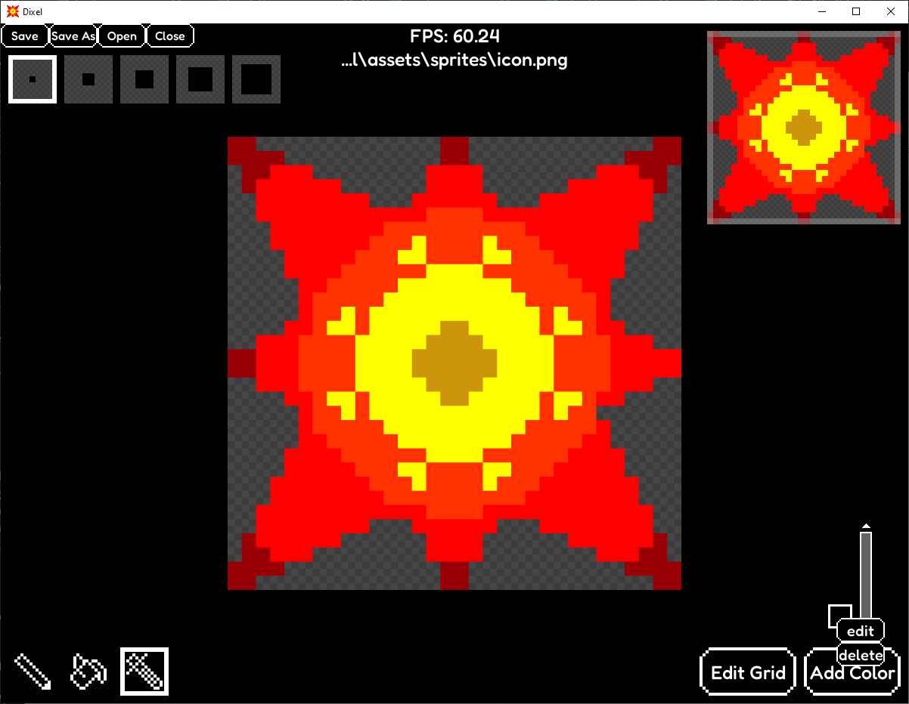

# Dixel

Drawing program for pixel art.

## Install instructions

Requires python 3.10.0 or higher, it can be installed from <https://www.python.org/downloads/>.\
Check with ```python3 --version```.

1. Clone the repository ```git clone https://github.com/Aston7292/dixel.git```
2. Open a terminal and go in the project directory
3. (Optional) Use a virtual environment
   * Make sure venv is installed on Linux\
   ```sudo apt update``` then ```sudo apt install python3-venv```
   * Create ```python3 -m venv virtual_environment```
   * Activate on Windows ```virtual_environment\Scripts\activate```
   * Activate on Linux ```source virtual_environment/bin/activate```
4. Install packages ```python3 -m pip install -r requirements.txt```
5. Run app ```python3 main.py```
6. (Optional) You can exit the virtual environment with ```deactivate```

### Possible errors (Linux)

* If importing tk fails\
```sudo apt update``` then ```sudo apt install python3-tk```.
* If you're not in a virtual environment and pip returns an "externally-managed-environment" error\
```python3 -m pip install -r requirements.txt --break-system-packages```.

## Features

**Load Images**: Import pngs and bitmaps into a pixel grid.\
**View Navigation**: Move the view for large images.\
**Edit Pixels**: Color and erase pixels.\
**Brush Size**: Select the brush size using checkboxes.\
**Palette Options**: Edit or delete a color from the palette with a drop-down menu.\
**Zooming**: Zoom in/out towards the mouse.\
**Minimap**: See the current position on the grid with a minimap.\
**Color Picker**: Select colors with a colorful and intuitive UI.\
**Resizable Grid**: Change the grid size and have a preview of how it will look.\
**Auto Save**: If you're editing an existing image it will be saved on close,
if the program crashes the image will always be saved.

### Tools

**Pencil**: Change individual pixels (x/y mirror)

## Keyboard functionality

### Window

**F1**: Reset window size\
**F5-F8**: Resize window\
**F11**: Toggle fullscreen

### Home

**ESC**: Close window\
**CTRL A**: Go to add color UI\
**CTRL G**: Go to edit grid UI\
**CTRL S**: Save file\
**CTRL SHIFT S**: Save file with name\
**CTRL O**: Open file\
**CTRL Q**: Close file\
**arrows/page down/page up/home/end**: move in scrollbars

### Checkbox grids

**arrows/home/end**: Move\
**CTRL arrows**: Move to the limit of the grid\
**CTRL 1-5**: Change brush size\
**CTRL E**: Edit selected color\
**CTRL Del**: delete selected color

### Grid

**arrows**: Move\
**Enter**: Draw\
**Backspace**: Erase\
**ALT arrows**: Move selected pixel by brush size\
**SHIFT arrows**: Move selected pixel by visible area\
**CTRL arrows**: Move selected pixel to the limit of the grid\
**CTRL +/-**: Zoom in/out\
**CTRL SHIFT +/-**: Zoom in/out until limit\
**CTRL R**: Reset offset and visible area

### UIs

**arrows/tab/SHIFT tab**: Move selection\
**CTRL left/right**: Go to end of text in input box\
**+/-**: Increment/decrement numerical slider by 1\
**SHIFT +/-**: Increment/decrement numerical slider by 10\
**CTRL +/-**: Increment/decrement numerical slider by 50\
**home/end**: Go to minimum/maximum numerical slider\
**CTRL K**: Toggle keep ratio in grid UI\
**Escape**: Close\
**Enter**: Confirm

## Screenshots

### Main Interface



### Color Picker


### Grid UI


